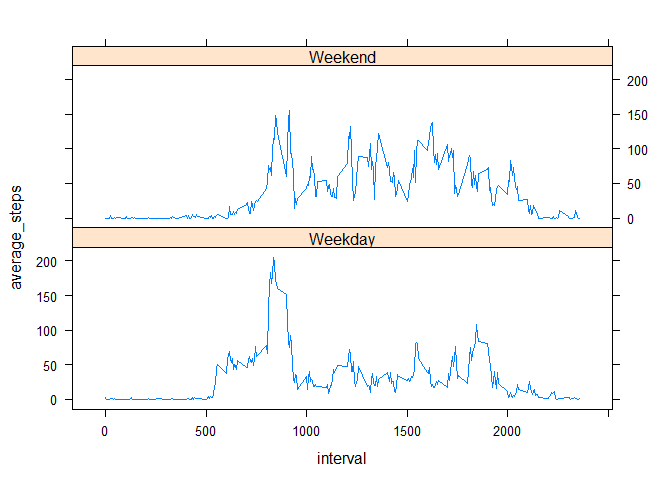

# Reproducible Research: Peer Assessment 1


```
## Warning: package 'readr' was built under R version 3.3.3
```

```
## Warning: package 'dplyr' was built under R version 3.3.3
```

```
## 
## Attaching package: 'dplyr'
```

```
## The following objects are masked from 'package:stats':
## 
##     filter, lag
```

```
## The following objects are masked from 'package:base':
## 
##     intersect, setdiff, setequal, union
```

```
## Warning: package 'ggplot2' was built under R version 3.3.3
```

```
## Warning: package 'knitr' was built under R version 3.3.3
```


## Loading and preprocessing the data


```r
data <- read_csv("activity.zip", col_names = TRUE)
```

```
## Parsed with column specification:
## cols(
##   steps = col_integer(),
##   date = col_date(format = ""),
##   interval = col_integer()
## )
```


## What is mean total number of steps taken per day?

**1-2. The total number of steps taken per day & a histogram of the total number of steps taken each day:**

```r
total_steps <- data %>% filter(!is.na(steps)) %>% group_by(date) %>% summarize(total_steps_aday = sum(steps))
```

```
## Warning: package 'bindrcpp' was built under R version 3.3.3
```

```r
ggplot(total_steps, aes(total_steps_aday)) + geom_histogram(binwidth = 2000)
```

<!-- -->

**3. The mean and median of the total number of steps taken per day:**

```r
mean(total_steps$total_steps_aday)
```

```
## [1] 10766.19
```

```r
median(total_steps$total_steps_aday)
```

```
## [1] 10765
```


## What is the average daily activity pattern?

**1. A time series plot (i.e. type = "l") of the 5-minute interval (x-axis) and the average number of steps taken, averaged across all days (y-axis):**  


```r
average_steps <- data %>% filter(!is.na(steps)) %>% group_by(interval) %>% summarise(average_steps_all_days = mean(steps))
ggplot(average_steps, aes(x=interval, y=average_steps_all_days)) + geom_line()
```

<!-- -->

**2. Which 5-minute interval, on average across all the days in the dataset, contains the maximum number of steps?**


```r
average_steps$interval[which(average_steps$average_steps_all_days == max(average_steps$average_steps_all_days))]
```

```
## [1] 835
```


## Imputing missing values

**1. Calculate and report the total number of missing values in the dataset (i.e. the total number of rows with NAs):**  


```r
data$steps %>% is.na() %>% sum()
```

```
## [1] 2304
```


**2-3. Devise a strategy for filling in all of the missing values in the dataset. Create a new dataset that is equal to the original dataset but with the missing data filled in:**    


```r
median_steps <- data %>% filter(!is.na(steps)) %>% group_by(interval) %>% summarise(median_steps_alldays = median(steps))

data_new <- data

for (i in 1:nrow(data_new)) {
    
    if (is.na(data_new$steps[i])) {
        
        data_new$steps[i] <- median_steps$median_steps_alldays[which(median_steps$interval == data_new$interval[i])]
    
    }
    
}
```


**4. Make a histogram of the total number of steps taken each day:**  


```r
total_steps_new <- data_new %>% group_by(date) %>% summarize(total_steps_aday = sum(steps))
ggplot(total_steps_new, aes(total_steps_aday)) + geom_histogram(binwidth = 2000)
```

<!-- -->

**Calculate and report the mean and median total number of steps taken per day.**   


```r
mean(total_steps_new$total_steps_aday)
```

```
## [1] 9503.869
```

```r
median(total_steps_new$total_steps_aday)
```

```
## [1] 10395
```

**What is the impact of imputing missing data on the estimates of the total daily number of steps?**  

The difference between the means before and after the imputing the missing data:  

```r
mean(total_steps$total_steps_aday) - mean(total_steps_new$total_steps_aday)
```

```
## [1] 1262.32
```

The difference between the meadians before and after the imputing the missing data:  

```r
median(total_steps$total_steps_aday) - median(total_steps_new$total_steps_aday)
```

```
## [1] 370
```

***
## Are there differences in activity patterns between weekdays and weekends?

**Create a new factor variable in the dataset with two levels - "weekday" and "weekend" indicating whether a given date is a weekday or weekend day:**    


```r
data_new <- data_new %>% mutate(weekday = weekdays(date)) 
data_new <- data_new %>% mutate(weekday = if_else(weekday == "Saturday" | weekday == "Sunday", "Weekend", "Weekday")) 
data_new <- data_new %>% mutate(weekday = as.factor(weekday))
```


**Make a panel plot containing a time series plot (i.e. type = "l") of the 5-minute interval (x-axis) and the average number of steps taken, averaged across all weekday days or weekend days (y-axis):**  


```r
average_steps_new <- data_new %>% group_by(weekday, interval) %>% summarise(average_steps = mean(steps))

#ggplot(average_steps_new, aes(x=interval, y=average_steps)) + geom_line() + facet_grid(weekday ~ .) 
xyplot(average_steps ~ interval|weekday, data = average_steps_new, type = "l", layout = c(1,2))
```

<!-- -->


